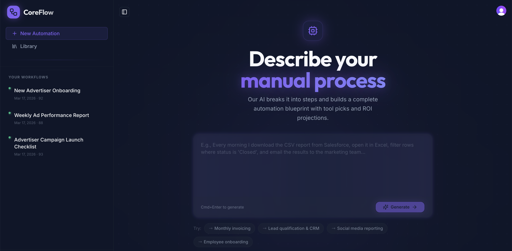

# CoreFlow

AI-powered workflow analysis: describe any manual process in natural language and get a visual automation blueprint, ROI estimates, and tool cost guidance.

## Overview

CoreFlow helps you:

- Turn long-form process descriptions into **structured workflows** with original steps and proposed automations.
- Visualize each workflow as a **flowchart** with time spent, time saved, and clear step-by-step descriptions.
- Quantify impact with a **ROI calculator** (runs/week, hourly cost, yearly savings).
- Track and compare opportunities in a **Workflow Library** and **Compare** view.
- Share results via **read-only reports** and **PDF exports** for stakeholders.

## Live demo

CoreFlow is live on Railway:

- **App**: https://coreflow.cc/

## Screenshot



## Tech stack

| Layer     | Technology                                                                 |
|----------|-----------------------------------------------------------------------------|
| Frontend | React 18, Vite, TypeScript, Tailwind CSS, Shadcn UI, Framer Motion, Wouter |
| Backend  | Node.js, Express 5, TypeScript                                              |
| Data     | PostgreSQL via Drizzle ORM                                                  |
| Contracts| Zod-powered shared route + schema layer (`shared/`)                         |
| State    | TanStack Query (server state), local React state for ROI inputs             |
| AI       | OpenAI (chat completions) for workflow generation                           |

## Key features

- **Natural language → workflow**  
  Paste a real-world process (invoices, onboarding, QA checks, etc.). CoreFlow generates:
  - Original step list with time per step  
  - Automation blueprint with proposed tools and time saved

- **Impact + ROI modeling**  
  - ROI calculator with runs/week and hourly cost inputs  
  - Time saved weekly/yearly and simple “priority score” to help decide what to automate first

- **Workflow Library & Compare**  
  - Library view of all saved workflows with key metrics  
  - Compare page to evaluate two workflows side-by-side before investing in automation

- **Reporting & sharing**  
  - Detailed workflow pages with flowchart visualization  
  - PDF export for executives / clients  
  - Read-only shared reports for easy distribution

## Getting started

### Prerequisites

- Node.js 20+
- PostgreSQL instance (local or hosted, e.g. Neon)
- [Clerk](https://clerk.com) account (free tier works) — create an app and grab the publishable key

### Local setup

```bash
git clone https://github.com/anthonyhastaba/CoreFlow.git
cd CoreFlow
npm install
```

Create a `.env` file in the project root (see **Environment** below). Then:

```bash
# Sync database schema
npm run db:push

# Start dev server (Express + Vite HMR)
npm run dev
```

By default the app runs on the port specified by `PORT` (or `5000` if unset).

## Scripts

| Command          | Description                                      |
|------------------|--------------------------------------------------|
| `npm run dev`    | Start dev server (Express + Vite HMR)            |
| `npm run build`  | Build client and server into `dist/`             |
| `npm start`      | Run production build (`dist/index.cjs`)          |
| `npm run db:push`| Sync Drizzle schema to PostgreSQL                |
| `npm run check`  | TypeScript type check (no emit)                  |

## Environment

All configuration is provided via `.env` (never commit this file):

| Variable                     | Required | Description                                          |
|------------------------------|----------|------------------------------------------------------|
| `DATABASE_URL`               | Yes      | PostgreSQL connection string                         |
| `OPENAI_API_KEY`             | Yes      | OpenAI API key used for workflow generation          |
| `CLERK_PUBLISHABLE_KEY`      | Yes      | Clerk publishable key (from Clerk dashboard)         |
| `OPENAI_BASE_URL`            | No       | Custom OpenAI base URL (defaults to api.openai.com)  |
| `PORT`                       | No       | Server port (default `5000`)                         |

See `.env.example` for a concrete template.

## Project structure

```text
client/      React SPA (pages, components, UI)
server/      Express API, Vite dev middleware, static serving
shared/      Zod schemas + typed route contracts
script/      Build tooling (esbuild + Vite)
```

High-level architecture, data flow, and conventions are documented in  
`ARCHITECTURE.md`.

## License

MIT
